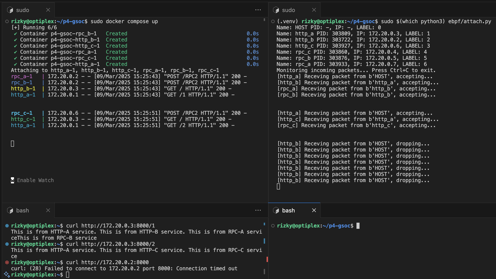

# P4 GSOC - Container Network Access Control with XDP
## How it Works
1. For every outgoing TCP SYN packet from a container, an XDP program attach a sender's label in the packet. Yes, it is an XDP program attached to container's veth pair that is located in the host's namespace
2. For every incoming TCP SYN packet to a container, a TC program extract the label and make decision based on access control that is stored in BPF map. It is attached to TC Egress of same veth mentioned above
## How to Run The Demo
1. Install [docker desktop](https://www.docker.com/products/docker-desktop/)/ [docker engine](https://docs.docker.com/engine/install/)
2. Build all containers
```
docker compose build
```
3. Run all containers
```
docker compose up
```
4. Now, we have this cluster. HTTP-A is the only public entry point with two endpoints, each with its own valid path
    * http://localhost:8001/1 : HTTP-A -> HTTP-B -> RPC-A & RPC-B
    * http://localhost:8001/2 : HTTP-A > HTTP-C -> RPC-C

5. [Install bcc](https://github.com/iovisor/bcc/tree/master)
6. Create virtual environment. Note that bcc is installed system-wide, don't forget to include it in your virtual environment
```
python3 -m venv .venv --system-site-packages
source .venv/bin/activate
pip install -r requirements.txt
```
7. Run eBPF agent. Sometimes, sudo execute with system-wide python3. You can replace python3 with $(which python3)
```
sudo python3 ebpf/detach.py
sudo python3 ebpf/attach.py
```
8. Send http request to http-a by looking for its IP address that is printed by the eBPF agent. It should work.
```
curl http://ip-address:8000/1
curl http://ip-address:8000/2
```
9. However, if you try to send request directly to http-b or http-c, it will fail.


10. You can modify the access control in ebpf/attach.py

